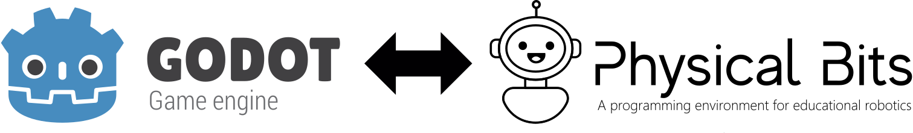
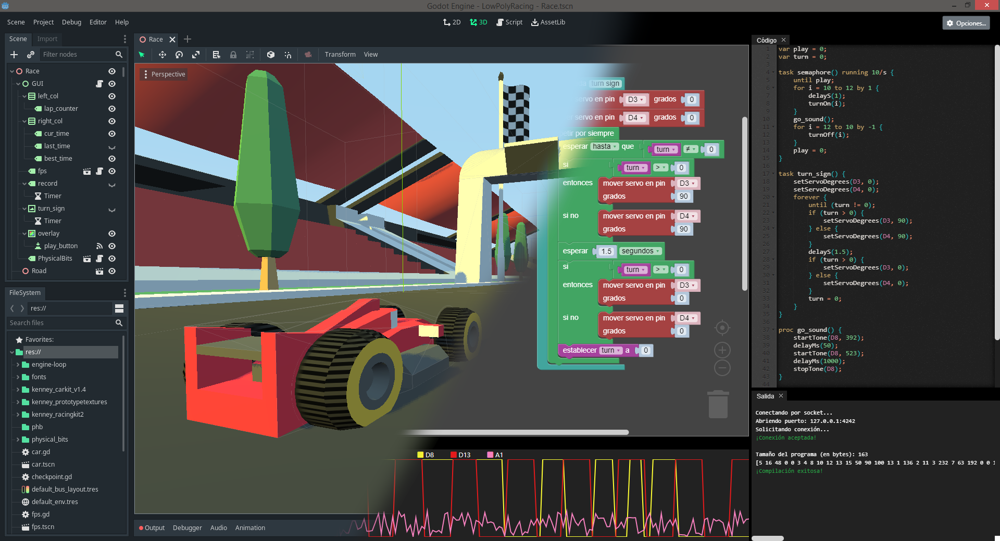

# 

A plugin for the godot engine that allows interaction with the Physical Bits programming environment.

## Acknowledgements

 - [Kenney's Racing Kit](https://www.kenney.nl/assets/racing-kit)
 - [Kenney's Car Kit](https://www.kenney.nl/assets/car-kit)
 - [Kenney's Prototype Textures](https://www.kenney.nl/assets/prototype-textures)
 - [qubodup's Car Engine Loop](https://opengameart.org/content/car-engine-loop-96khz-4s)

  
